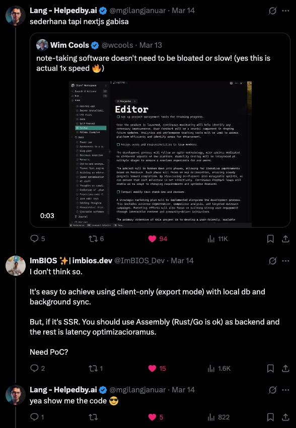

# Thymer in a Nextshell

## Terminology

- **Thymer**: A smart new editor (IDE) designed to write, plan or share big ideas at the speed of thought.
- **Nextshell**: it's actually Nutshell, but Next.js.
- **Nutshell**: very briefly, giving only the main points: "What went wrong?" "In a nutshell, everything."

## How does it start?

Everything starts with [a tweet](https://x.com/ImBIOS_Dev/status/1900574102517325897):

  
  

and ok, I'm not sure if I'm ready to build this, but I'm sure as heck going to try.

## Challenges

The only challenge main objective is performance of data/page loading time.

### Requirements

- [ ] 10-50ms page load time (idintified from the 60fps vids), use automated testing to be the objective judge
- [ ] have similar UI, no need to be pixel perfect nor identical
- [ ] use Next.js

No need to be serious or take so much time, it's just having fun.

## Plans

At first glance, I thought I would test full client-side rendering and full server-side rendering. But, after reading this data:

  

I'm located in Indonesia, and having 50ms as the best latency is a very terrible start. So, I think I will start with a hybrid approach similar to Thymer's approach.

Before we deep dive into how the high-level plan of hybrid, offline-first, or client-first approach. We need to test wether Next.js navigation in local or client-side is faster than 10ms.
