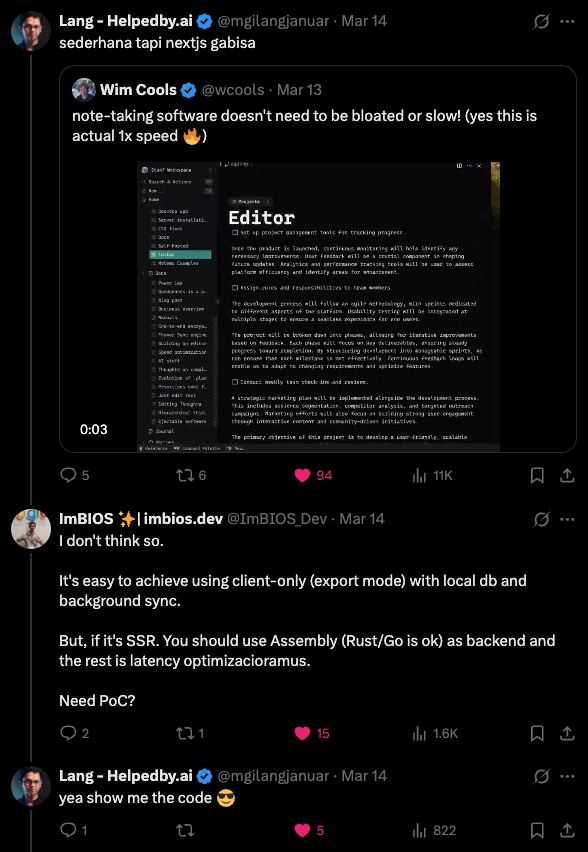
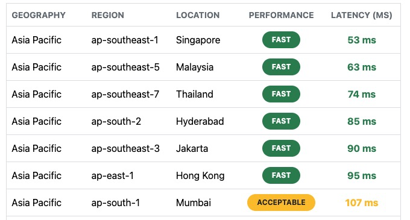

# Thymer in a Nextshell

## Terminology

- **Thymer**: A smart new editor (IDE) designed to write, plan or share big ideas at the speed of thought.
- **Nextshell**: it's actually Nutshell, but Next.js.
- **Nutshell**: very briefly, giving only the main points: "What went wrong?" "In a nutshell, everything."

## How does it start?

Everything starts with [a tweet](https://x.com/ImBIOS_Dev/status/1900574102517325897):

<div style="display: flex; justify-content: space-between; align-items: center; flex-wrap: wrap;">
  
  
</div>

and ok, I'm not sure if I'm ready to build this, but I'm sure as heck going to try.

## Challenges

The only challenge main objective is performance of data/page loading time.

### Requirements

- [ ] 17-50ms page load time (idintified from the 60fps vids), use automated testing to be the objective judge
  - p90 of <17ms
  - p95 of <50ms
- [ ] have similar UI, no need to be pixel perfect nor identical
- [ ] use Next.js

No need to be serious or take so much time, it's just having fun.

## Plans

At first glance, I thought I would test full client-side rendering and full server-side rendering. But, after reading this data:

<div style="display: flex; justify-content: center;">
  
</div>

I'm located in Indonesia, and having 50ms as the best latency is a very terrible start. So, I think I will start with a hybrid approach similar to Thymer's approach.

Before we deep dive into how the high-level plan of hybrid, offline-first, or client-first approach. We need to test wether Next.js navigation in local or client-side is faster than 10ms.

## Nx

### Run tasks

To run the dev server for your app, use:

```sh
npx nx dev lab-1-next-nav-time
```

To create a production bundle:

```sh
npx nx build lab-1-next-nav-time
```

To see all available targets to run for a project, run:

```sh
npx nx show project lab-1-next-nav-time
```

These targets are either [inferred automatically](https://nx.dev/concepts/inferred-tasks?utm_source=nx_project&utm_medium=readme&utm_campaign=nx_projects) or defined in the `project.json` or `package.json` files.

[More about running tasks in the docs &raquo;](https://nx.dev/features/run-tasks?utm_source=nx_project&utm_medium=readme&utm_campaign=nx_projects)

### Add new projects

While you could add new projects to your workspace manually, you might want to leverage [Nx plugins](https://nx.dev/concepts/nx-plugins?utm_source=nx_project&utm_medium=readme&utm_campaign=nx_projects) and their [code generation](https://nx.dev/features/generate-code?utm_source=nx_project&utm_medium=readme&utm_campaign=nx_projects) feature.

Use the plugin's generator to create new projects.

To generate a new application, use:

```sh
npx nx g @nx/next:app demo
```

To generate a new library, use:

```sh
npx nx g @nx/react:lib mylib
```

You can use `npx nx list` to get a list of installed plugins. Then, run `npx nx list <plugin-name>` to learn about more specific capabilities of a particular plugin. Alternatively, [install Nx Console](https://nx.dev/getting-started/editor-setup?utm_source=nx_project&utm_medium=readme&utm_campaign=nx_projects) to browse plugins and generators in your IDE.

[Learn more about Nx plugins &raquo;](https://nx.dev/concepts/nx-plugins?utm_source=nx_project&utm_medium=readme&utm_campaign=nx_projects) | [Browse the plugin registry &raquo;](https://nx.dev/plugin-registry?utm_source=nx_project&utm_medium=readme&utm_campaign=nx_projects)

[Learn more about Nx on CI](https://nx.dev/ci/intro/ci-with-nx#ready-get-started-with-your-provider?utm_source=nx_project&utm_medium=readme&utm_campaign=nx_projects)

### Install Nx Console

Nx Console is an editor extension that enriches your developer experience. It lets you run tasks, generate code, and improves code autocompletion in your IDE. It is available for VSCode and IntelliJ.

[Install Nx Console &raquo;](https://nx.dev/getting-started/editor-setup?utm_source=nx_project&utm_medium=readme&utm_campaign=nx_projects)

### Useful links

Learn more:

- [Learn more about this workspace setup](https://nx.dev/nx-api/next?utm_source=nx_project&utm_medium=readme&utm_campaign=nx_projects)
- [Learn about Nx on CI](https://nx.dev/ci/intro/ci-with-nx?utm_source=nx_project&utm_medium=readme&utm_campaign=nx_projects)
- [Releasing Packages with Nx release](https://nx.dev/features/manage-releases?utm_source=nx_project&utm_medium=readme&utm_campaign=nx_projects)
- [What are Nx plugins?](https://nx.dev/concepts/nx-plugins?utm_source=nx_project&utm_medium=readme&utm_campaign=nx_projects)

And join the Nx community:

- [Discord](https://go.nx.dev/community)
- [Follow us on X](https://twitter.com/nxdevtools) or [LinkedIn](https://www.linkedin.com/company/nrwl)
- [Our Youtube channel](https://www.youtube.com/@nxdevtools)
- [Our blog](https://nx.dev/blog?utm_source=nx_project&utm_medium=readme&utm_campaign=nx_projects)
